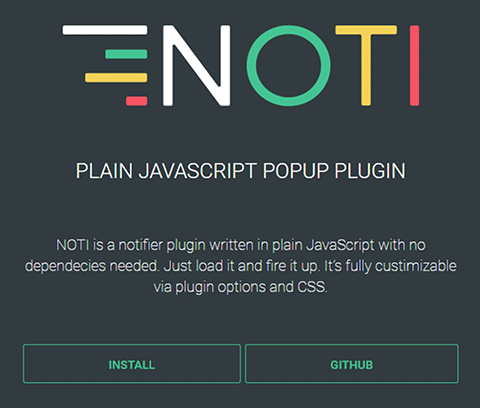

NOTI is a notifier plugin written in plain JavaScript with no dependecies needed. Just load it and fire it up. It’s fully custimizable via plugin options and CSS.:

## Documentation

Documentation and demo can be found here:
[https://weekaah.github.io/noti/](https://weekaah.github.io/noti/)

## Info

* fully customizable via css and plugin options
* sass support
* optional dark and light ui theme
* no dependencies needed

## License

© 2016 [Viktor Lesic](https://github.com/weekaah)  
Released under the [MIT LICENSE](http://opensource.org/licenses/MIT)
